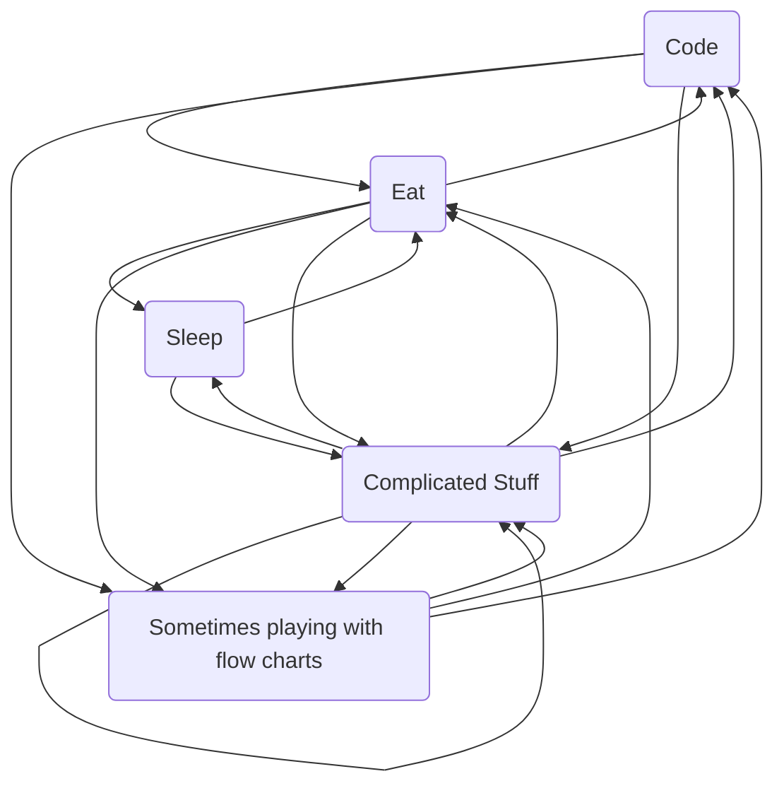

### Hi there 👋
I'm Colin, 25 years old, and work as a Frontend Web Developer and UX Engineer.

  
    
  

<!--
**colfin-96/colfin-96** is a ✨ _special_ ✨ repository because its `README.md` (this file) appears on your GitHub profile.

Here are some ideas to get you started:

- 🔭 I’m currently working on ...
- 🌱 I’m currently learning ...
- 👯 I’m looking to collaborate on ...
- 🤔 I’m looking for help with ...
- 💬 Ask me about ...
- 📫 How to reach me: ...
- 😄 Pronouns: ...
- ⚡ Fun fact: ...
-->

## Currently Learning / Interested In
- Tailwind CSS
- Firebase
- npm packaging

## I Know
- HTML
- JavaScript / TypeScript
- CSS / SCSS / SASS / Tailwind CSS
- Angular
- C#

## Flow

